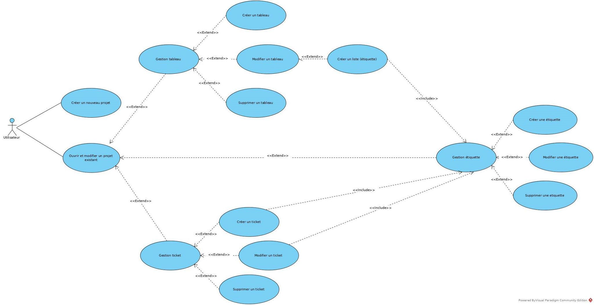
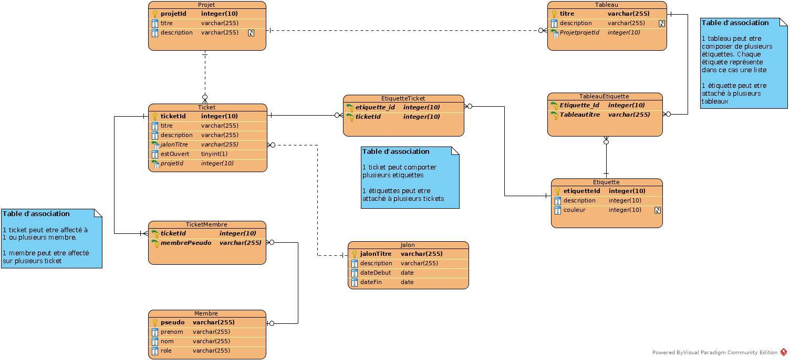
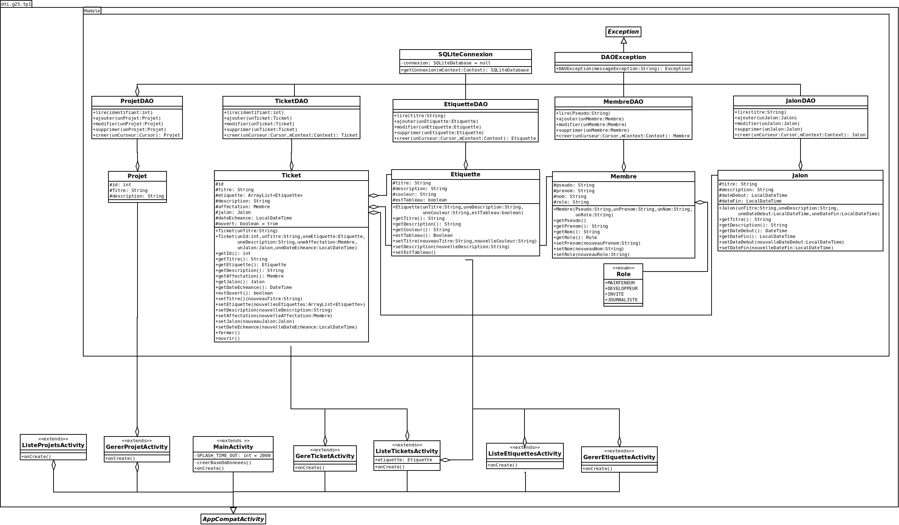

## <span style="text-align: center; font-size: 30px;"> Documentation du TP1 (TicketLab)</span>

###### Simon Roy, Sébastien Varmandele <br> Philippe Joubarne, Bryan Valdiviezo <br><br> Depuis le : 10/02/2020 <br> Mise à jours le : 24/02/2020 <br>

## Table des matières

- [Schémas](#schema)
    - [Use Cases](#useCases)
    - [Schéma de base de données](#umlBD)
    - [Schéma de Classes](#umlClasses)
- [Architecture du programme](#architecture)
- [Les entités](#entites)
	+ [Projet](#projet)
	+ [Ticket](#ticket)
	+ [Etiquette](#etiquette)
	+ [Membre](membre)
		* [Role](#role)
	+ [Jalon](#jalon)
- [Les DAO](#dao)
    + [Connexion SQLite](#sqlite)
- [Informations complémentaires](#infos)
	- [Mockup](#mockup)


## <a id="schema">Schéma</a>

### <a id="useCases">Use cases</a>


<br>

### <a id="umlBD">Schéma UML de base de données</a>


<br>

### <a id="umlClasses">Schéma UML de classes</a>



## <a id="architecture">Architecture (MVP)	</a>
	app/src/main/java/dti/g25/
		-> domain
			-> entite
				-> Tous les entités / objets du programme (Projet, Ticket, Etiquette, Membre, Jalon, Role)
			-> interacteur
				-> Interfaces pour les interacteurs
				-> Classes qui permet l'interaction avec les modèles [Implémente sont interface interacteur]
		-> presentation
			-> modele
				-> Modele.java (Sert à référencer les entités dans le domaine)
			-> presenteur
				-> IPresenteur.java (L'interface des présenteurs)
				-> Les présenteurs [implémente l'interface IPresenteur] (ListeTicketPrensenteur, GererTicketPrensenteur, VoirTickerPresenteur, ...)
			-> vue
				-> IVue.java (L'interface des vues)
				-> Les vus [implémente l'interface IVue] (ListeTicketVue, GererTicketVue, VoirTickerVue, ...)


## <a id="entites">Les entités</a>

### <a id="projet">Projet</a>

### <a id="ticket">Ticket</a>

### <a id="etiquette">Etiquette</a>

### <a id="membre">Membre</a>
#### <a id="role">Role</a>
L'enum `Role` contient tous les rôles qu'un membre peut avoir. Il y à quatre rôles disponible.

1. MAINTENEUR
2. DEVELOPPEUR
3. INVITÉ    			
4. JOURNALISTE 		

#### <a id="jalon">Jalon</a>

## <a id="dao">Les DAO</a>
Les classes DAO doivent implémenter l'interface `DAO`. Cet interface contient les méthodes suivante : lire, ajouter, modifier et supprimer. Chaque méthode de l'interface DAO lance une `DAOException` en cas d'erreur lors de la récupération des données.  

### <a id="sqlite">Connexion SQLite</a>
Pour que la communication entre l'activité et la base de données fonctionne, il faut passer le`context` de l'activité à la classe de connexion `(SQLiteConnexion)`. Pour ce faire, la classe `SQLiteConnexion` contient une variable `(mContext)` statique. Celle-ci prend le contexte de l'activité. Puisque le contexte change entre chaque activité, il faut changer la valeur de la variable par la valeur du contexte de la nouvelle activité en utilisant le mutateur (setContext) de la classe SQLiteConnexion.

> Il faut changer la valeur du contexte pendant la création de l'activité soit, dans son onCreate.

```java
    @Override
    protected void onCreate(Bundle savedInstanceState) {
        super.onCreate(savedInstanceState);
        setContentView(R.layout.activity_menu);
        getSupportActionBar().hide(); // Cacher la barre de titre
        SQLiteConnexion.setContext(this);
        ...
    }
```

<br>

> Nb. La méthode `getConnexion lance une SQLException` en cas d'erreur de connexion avec la base de données SQLite. Donc, il faut s'assurer que les erreurs seront attrapées.


## <a id="infos">Informations complémentaires</a>
### <a id="mockup">Mockup</a>
[Lien vers le mockup](https://www.figma.com/proto/OZH1sbwceQr83PpX4KeLZQ/TicketLab?node-id=295%3A2&scaling=scale-down)

----

Développé dans le cadre du [TP1](https://git.dti.crosemont.quebec/equipe-app-native-2/ticketlab-tp1) du cours d'application native 2 (420-G25-RO) <br> Collège de Rosemont
